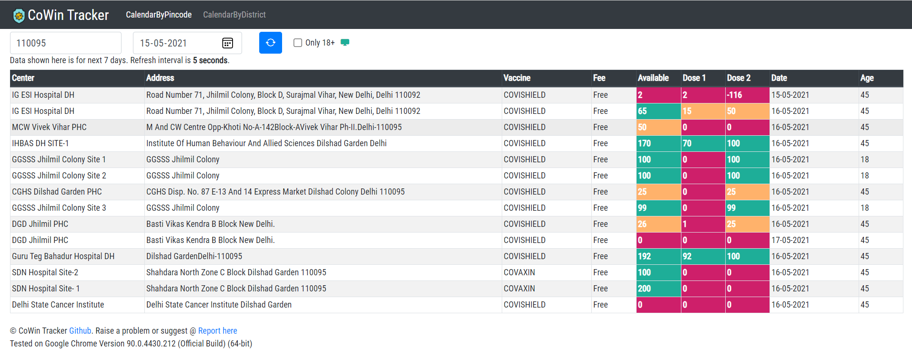

# CoWin Tracker
[https://cowin-slots-tracker.netlify.app/](https://cowin-slots-tracker.netlify.app/)

CoWin tracker continuously checks for slot availability on CoWin open APIs and presents them in a beautiful table grid.



## Build
```sh
ng build --prod --base-href "https://cowin-slots-tracker.netlify.app/"
```

### Handle 404 on gihub pages
Create a copy of index.html and rename it 404.html, so that when it doesn't find the page, it goes on 404.

### Handle refresh on Netlify
Create a file _redirects in your src folder, add the following to it:

```http
/*  /index.html 200
```

In your angular.json file add the following to projects.architect.build.options.assets

```json
{
  "glob": "_redirects",
  "input": "src",
  "output": "/"
}
```
